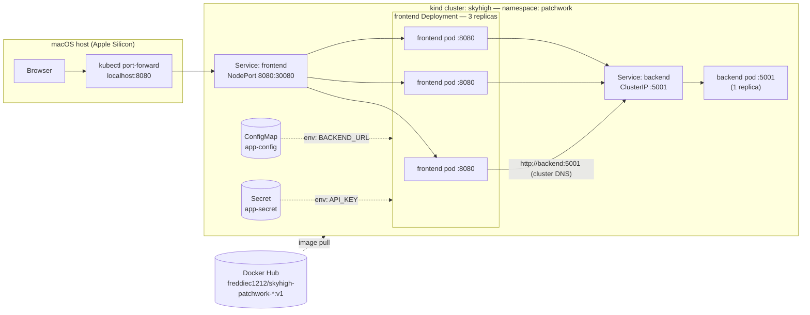

# SkyHigh Patchwork Lab — Docker & Kubernetes Deployment

## Project Description

I took a two-service Flask application from bare Python on my laptop to a self-healing Kubernetes deployment: containerized both services with hardened Dockerfiles, verified them locally with Docker Compose, published the images to Docker Hub, and deployed them to a kind cluster with health probes, externalized configuration, and demonstrated automatic pod recovery. 

**The scenario:** A startup is running everything on a single EC2 instance. They need horizontal scaling, automatic recovery, and zero-downtime deployments, and this project is that migration in miniature. 

**Built with:** Python/Flask · Docker · Docker Compose · Docker Hub · Kubernetes (kind) · ConfigMaps & Secrets


---


## What You'll Learn

- Build slim, non-root Docker images with cache-efficient layer ordering (`requirements.txt` before code)
- Explain and apply the difference between `EXPOSE` (metadata) and published ports (`-p` / `ports:`)
- Wire service-to-service communication three ways with one unmodified image: localhost fallback, Compose DNS, and Kubernetes cluster DNS via a `BACKEND_URL` environment variable
- Write Kubernetes Deployments with readiness and liveness probes, resource requests/limits, and label selectors that don't collide
- Expose workloads correctly with ClusterIP (internal-only) and NodePort Services — and know why NodePort on kind still needs `kubectl port-forward`
- Externalize configuration with ConfigMaps and Secrets mounted as environment variables via `valueFrom`
- Diagnose deployment drift using ReplicaSet template hashes ("the hash didn't move" = your change never reached the cluster)
- Recover from real failures: port squatters, stale kubectl contexts, unsaved manifests, and piecemeal applies
- Demonstrate self-healing by deleting a pod and watching the ReplicaSet replace it in under a minute with zero downtime


---


## Proof of Production


*Both images built on python:3.11-slim — ~52MB of unique layers each, far under the "1GB means you didn't think about it" bar.*


*`docker compose ps`: frontend publishes 8080; the backend has no published port and reachable only on the internal Docker network.*


*The app under Compose — "Served by backend" shows a container ID, proving the frontend resolved the backend by Compose DNS. Screenshot will show request count 1 and 4 to show the count increments. no command — browser → http://localhost:8080*


*One backend, three frontends, all 1/1 READY (readiness probes passing) with 0 restarts (liveness probes never had to act).*


*Backend sealed as ClusterIP on 5001; frontend as NodePort 8080:30080.*


*The same image, now serving through the full K8s chain — the hostname is a pod name (`backend-749bf749dc-8wb9j`).*

*After deleting a frontend pod, the ReplicaSet created a replacement (same template hash, new name) in under a minute — no human intervention.*


*`kubectl exec ... printenv` proving `BACKEND_URL` and `API_KEY` arrive from the ConfigMap and Secret, not the image or manifest.*


---


## Architecture



**Request flow:**

1. Browser requests `http://localhost:8080` on Mac.
2. `kubectl port-forward` tunnels the request into the cluster to the `frontend` Service.
3. The Service routes to one of three ready frontend pods (readiness probes gate membership).
4. The frontend reads `BACKEND_URL` (injected from the ConfigMap) and calls `http://backend:5001` | cluster DNS resolves the Service name.
5. The `backend` ClusterIP Service forwards to the backend pod on 5001.
6. Flask increments an in-memory counter and returns JSON with its pod hostname. The frontend renders it with Jinja2. If the backend is unreachable, the frontend degrades gracefully with an error message instead of a 500.


---


## Prerequisites

| Tool | Version used | Install |
|---|---|---|
| macOS (Apple Silicon) | — | — |
| Docker Desktop | with Compose v2 | [docker.com](https://www.docker.com/products/docker-desktop/) |
| kind | cluster running K8s v1.36.1 | `brew install kind` |
| kubectl | matching cluster | `brew install kubectl` |
| Python | 3.14 via Homebrew (host); 3.11 in containers | `brew install python` |
| Docker Hub account | free tier, public repos | [hub.docker.com](https://hub.docker.com) |

No AWS account required — this project runs entirely locally.


---


## Tech Stack

| Technology | Role in this project | Why I chose it |
|---|---|---|
| Flask | Both services (JSON API + HTML frontend) | Minimal — the point is the containers, not the app |
| python:3.11-slim | Base image | ~150MB with working pip wheels; alpine's musl breaks Python wheels, full image is ~1GB of attack surface |
| Docker | Containerization | Isolation, reproducible builds, identical artifact across all environments |
| Docker Compose | Local two-service orchestration | Verifies networking and env-var config before Kubernetes adds complexity |
| Docker Hub | Public image registry | kind pulls public images with zero auth config; public repos double as portfolio artifacts (ECR is the production answer) |
| kind | Local Kubernetes | Free, disposable, runs the real K8s API as Docker containers |
| ConfigMap / Secret | Externalized configuration | Config lives in the environment, not the image or manifest — the 12-factor pattern |


---


## Security Decisions

| What I did | What it prevents |
|---|---|
| Non-root `appuser` in both Dockerfiles (`USER` after install, before `CMD`) | An app exploit lands in an unprivileged account instead of root-in-container, one kernel bug from root on the host |
| `python:3.11-slim` pinned base, `:v1` tags everywhere — never `latest` | Smaller attack surface, fewer CVEs to scan, reproducible builds that don't change under you |
| `.dockerignore` (`venv/`, `**__pycache__/`, `*.pyc`, `.git/`, `.env`) in both build contexts | Secrets and git history can't leak into image layers — files "deleted" in later layers persist in earlier ones forever |
| Backend has no published port in Compose and is ClusterIP-only in K8s | The API is unreachable from outside; only the frontend edge is exposed |
| `debug=False` in Flask | Flask's debug console is remote code execution as a feature |
| Exec-form `CMD ["python", "app.py"]` | App is PID 1 and receives SIGTERM — graceful shutdown instead of a hard kill on every deploy |
| Secret mounted via `secretKeyRef`, value is deliberately fake | Demonstrates the pattern; the committed manifest contains no real credential. Base64 is not encryption — in production I'd source from AWS Secrets Manager |
| Resource requests and limits on every container | A runaway container gets throttled (CPU) or killed (memory) instead of starving the node |
| `.gitignore` (`venv/`, `.env`, `.DS_Store`, `.vscode/`) created before `git init` | Secrets and junk never enter git history, where removal requires rewriting history and rotating credentials |


---


## Deployment Steps

### Run locally (Docker Compose)

```bash
# 1. Clone and enter project
git clone https://github.com/freddie-c/Skyhigh-portfolio-project-03-Docker-and-Kubernetes-Deployment.git

# 2. Navigate into the project directory
cd Skyhigh-Patchwork-Lab

# 3. Build both images (or skip — Compose will pull them from Docker Hub)
docker build -t freddiec1212/skyhigh-patchwork-backend:v1  ./backend
docker build -t freddiec1212/skyhigh-patchwork-frontend:v1 ./frontend

# 4. Start the stack
docker compose up -d

# 5. Verify
docker compose ps
# frontend: 0.0.0.0:8080->8080/tcp — backend: 5001/tcp only (unpublished)

curl -v http://localhost:5001/api/count
# EXPECTED: Connection refused — the backend is sealed inside the Docker network. This is the pass condition.
```

Open **http://localhost:8080** — the page shows the backend container's ID as the hostname and a counter that climbs on refresh.

```bash
# 6. Stop
docker compose down
```

> macOS note: the backend uses port 5001 because AirPlay Receiver squats on 5000 (see Challenges).

### Run on Kubernetes (kind)

Images are pulled from public Docker Hub repos, so no `kind load` step is needed.

```bash
# 1. Verify you're pointed at the RIGHT cluster (see Challenges — this bit me)
kubectl config use-context kind-skyhigh
kubectl get nodes
# EXPECTED: skyhigh-control-plane   Ready

# 2. Create the namespace
kubectl create namespace patchwork

# 3. Apply every manifest as a unit, with strict validation
kubectl apply -f k8s/ --validate=strict

# 4. Watch the rollout
kubectl get pods -n patchwork -w
# EXPECTED: 4 pods (backend x1, frontend x3) reach Running 1/1
# READY 1/1 means the readiness probe on /health passed

# 5. Verify Services and endpoints
kubectl get svc -n patchwork
# backend    ClusterIP   ...   5001/TCP
# frontend   NodePort    ...   8080:30080/TCP
kubectl get endpoints -n patchwork
# backend: one pod IP — frontend: three pod IPs

# 6. Verify externalized config arrived inside a container
kubectl exec -n patchwork deploy/frontend -- printenv BACKEND_URL API_KEY
# http://backend:5001
# fake-skyhigh-patchwork-lab-key-2810

# 7. Reach the app (kind's node is a Docker container, so NodePort
#    isn't reachable from the Mac without cluster-creation port mappings —
#    port-forward is the bridge)
kubectl port-forward -n patchwork svc/frontend 8080:8080
```

Open **http://localhost:8080** — "Served by backend" now shows a **pod name**.

```bash
# 8. Self-healing demo — terminal A:
kubectl get pods -n patchwork -w
# terminal B:
kubectl delete pod <frontend pod name goes here> -n patchwork
# EXPECTED: replacement pod (same ReplicaSet hash, new suffix) reaches 1/1
# in under a minute while the page keeps serving
```


---


## Challenges and Solutions

**1. Port 5000 returned `403 Forbidden` from `Server: AirTunes/950.7.1`**
- **Problem:** `curl -v http://localhost:5000/api/count` returned a 403 with Apple headers; Flask had crashed on startup with `Address already in use`.
- **Root cause:** macOS AirPlay Receiver permanently occupies port 5000 on the host. The `Server: AirTunes` response header identified the squatter by name.
- **Solution:** Moved the backend to port 5001 which was a config-level fix (app, Dockerfile `EXPOSE`, Compose, K8s manifests all updated consistently) rather than modifying the host. Lesson: `curl -v` over `curl -s` when debugging; the `Server:` header tells you *who* answered.

**2. Frontend showed "Backend unreachable: [Errno 61] Connection refused"**
- **Problem:** The page rendered but displayed the graceful-degradation error instead of data.
- **Root cause:** The backend process had crashed earlier (port conflict) and was never restarted.
- **Solution:** Restarted Flask. Banked the diagnostic: `Connection refused` = nothing listening; a timeout = something listening but slow; an unexpected `Server:` header = the wrong tenant answered. Three different diagnoses from one curl.

**3. `kubectl get nodes` returned a cluster I didn't recognize (`desktop-control-plane`)**
- **Problem:** `kind get clusters` said `skyhigh`, but kubectl showed an old node named `desktop-control-plane`.
- **Root cause:** Docker Desktop's built-in Kubernetes had been enabled and hijacked the current kubectl context. Every command was silently going to the wrong cluster.
- **Solution:** `kubectl config get-contexts` revealed the `*` on `docker-desktop`; `kubectl config use-context kind-skyhigh` fixed it. New habit: verify the context before any apply — deploying to the wrong cluster is a classic production incident.

**4. `kubectl apply -f k8s/` → `error: no objects passed to apply`**
- **Problem:** The apply found nothing to deploy despite the manifests being "written."
- **Root cause:** The YAML files were open in VS Code but never saved to disk. The editor tab showed a dot instead of an ×.
- **Solution:** Saved file, re-apply. Verification habit: `ls k8s/` and check tab state before blaming the tooling.

**5. `printenv API_KEY` → exit code 1 after applying the Secret**
- **Problem:** The Secret applied cleanly (`created`), but the variable didn't exist in the frontend pods, even after a `rollout restart`.
- **Root cause:** The frontend Deployment's `valueFrom` env edit and the ConfigMap had never been applied to the cluster, but only the Secret had, piecemeal. The tell: the frontend ReplicaSet hash hadn't changed since the original deploy, proving the pod template the cluster knew about was still the old one. A restart faithfully recreates pods from the *cluster's* template; it can't apply edits that never left my laptop.
- **Solution:** `kubectl get configmap,secret -n patchwork` confirmed the ConfigMap was missing; `kubectl apply -f k8s/` as a whole folder created it and rolled the frontends to a new hash with both variables present. Lessons: apply multi-object changes as a unit, verify cluster state instead of assuming disk state reached it, and read ReplicaSet hashes as template fingerprints.

**6. Old pods flashed `Error` status while terminating during rollouts**
- **Problem:** Terminating pods briefly showed `Error` in `kubectl get pods -w` during every rolling update.
- **Root cause:** Flask's dev server exits non-zero (143) on SIGTERM; Kubernetes records the exit code. Cosmetic, not a failure.
- **Solution:** None needed, but knowing which errors are noise is half of operating a cluster. A production image would run gunicorn with proper signal handling.

**7. Path and venv failures on macOS (`no such file or directory`, half-built venvs)**
- **Problem:** `cd /backend` failed (absolute vs relative path); an interrupted `python3 -m venv` left a broken venv that couldn't be activated; a folder rename broke the venvs entirely.
- **Root cause:** Leading `/` means filesystem root; Ctrl+C mid-creation leaves no `bin/activate`; venvs hardcode absolute paths at creation and break when any parent folder is renamed.
- **Solution:** `rm -rf venv` and rebuild; tab-completion and `pwd` as pre-flight habits. Long-term fix: containers replaced the venvs entirely, each image carries its own dependencies.

**8. Risk of verifying the wrong stack (Compose vs Kubernetes on the same port)**
- **Problem:** Both the Compose frontend and `kubectl port-forward` want Mac port 8080.
- **Root cause:** Two copies of the same app answering on the same port means you can "verify" Kubernetes while actually talking to Compose.
- **Solution:** `docker compose down` before port-forwarding, only one running copy at a time when testing. The hostname on the page is the fingerprint: container hex ID = Compose; pod name = Kubernetes.


---


## Cost Notes

**$0. This project runs entirely on local hardware.** The kind cluster is Docker containers on my Mac, Docker Hub public repositories are free, and no AWS resources are created. Nothing bills if forgotten, but the only overnight cost is laptop RAM, and stopping the kind container reclaims that.


---


## Teardown

```bash
# 1. Stop the port-forward tunnel (Ctrl+C in its terminal)

# 2. Delete the entire application — namespace deletion cascades to
#    deployments, pods, services, configmap, and secret
kubectl delete namespace patchwork

# 3. Verify it's gone
kubectl get all -n patchwork
# EXPECTED: No resources found (then the namespace itself disappears)

# 4. Tear down the Compose stack if running
docker compose down
docker compose ps
# EXPECTED: empty table

# 5. Optional: reclaim RAM by pausing the kind cluster (survives restart)
docker stop skyhigh-control-plane

# 6. Optional: remove local images (Docker Hub copies are unaffected)
docker rmi freddiec1212/skyhigh-patchwork-backend:v1 freddiec1212/skyhigh-patchwork-frontend:v1
```

Resurrection from nothing is ~90 seconds: `kubectl create namespace patchwork && kubectl apply -f k8s/ --validate=strict` the repo is the source of truth, the cluster is disposable.


---


## Project Structure

```
skyhigh-patchwork-lab/
├── backend/
│   ├── app.py                    # Flask JSON API: /api/count (hostname + counter), /health
│   ├── requirements.txt          # flask==3.0.3 (pinned)
│   ├── Dockerfile                # python:3.11-slim, non-root, layer-cached, EXPOSE 5001
│   └── .dockerignore             # keeps venv/, .git/, .env out of the build context
├── frontend/
│   ├── app.py                    # Flask HTML frontend; calls BACKEND_URL server-side, degrades gracefully
│   ├── templates/
│   │   └── index.html            # Jinja2 template (auto-escaped output)
│   ├── requirements.txt          # flask==3.0.3, requests==2.32.3
│   ├── Dockerfile                # same pattern, EXPOSE 8080, copies templates/
│   └── .dockerignore
├── k8s/
│   ├── app-config.yml            # ConfigMap: BACKEND_URL=http://backend:5001
│   ├── app-secret.yml            # Secret: fake API_KEY (committed intentionally — demo pattern only)
│   ├── backend-deployment.yml    # 1 replica, probes on /health:5001, resource limits
│   ├── backend-service.yml       # ClusterIP :5001 — internal only, this line IS the DNS name "backend"
│   ├── frontend-deployment.yml   # 3 replicas, probes on /health:8080, env via valueFrom
│   └── frontend-service.yml      # NodePort 8080:30080
├── docker-compose.yml            # local two-service stack; backend unpublished
├── .gitignore                    # venv/, .env, .DS_Store, .vscode/ — created before git init
└── README.md
```


---


## Future Improvements

1. **Versioned rolling update (`v1` → `v2`)** — visible app change, rebuild, push, `kubectl set image`, watch the zero-downtime roll, then `kubectl rollout undo`.
2. **CI/CD with GitHub Actions** — build, tag, and push images on every commit using the OIDC pattern I've used for AWS auth (no stored keys).
3. **Gunicorn instead of Flask's dev server** — production WSGI with proper worker management and clean SIGTERM handling (kills the cosmetic `Error` exit status too).
4. **Redis for the counter** — the in-memory counter resets on every pod restart and diverges across replicas; external state is the fix.
5. **Deploy to Amazon EKS with ECR** — managed control plane, IAM-integrated private registry, and a real LoadBalancer Service replacing the NodePort/port-forward workaround.
6. **Helm chart** — template the manifests so replica counts, image tags, and ports become values instead of hardcoded YAML.
7. **Ingress controller** — path-based routing and a single entry point instead of NodePort.
8. **Monitoring** — Prometheus + Grafana for the metrics that requests/limits are currently set by guesswork.
